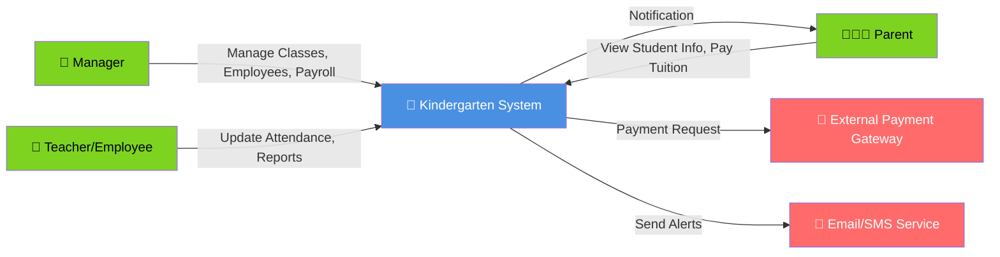
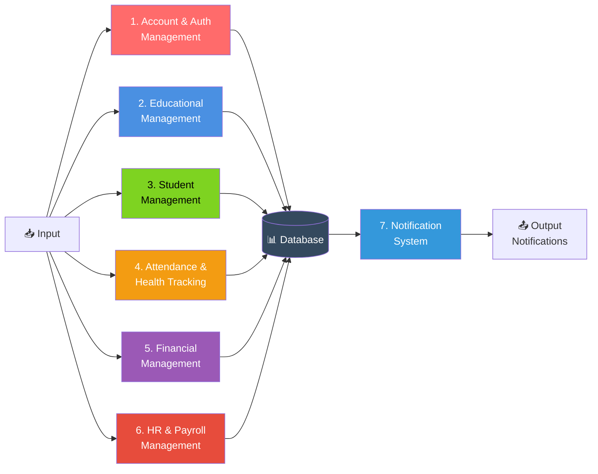
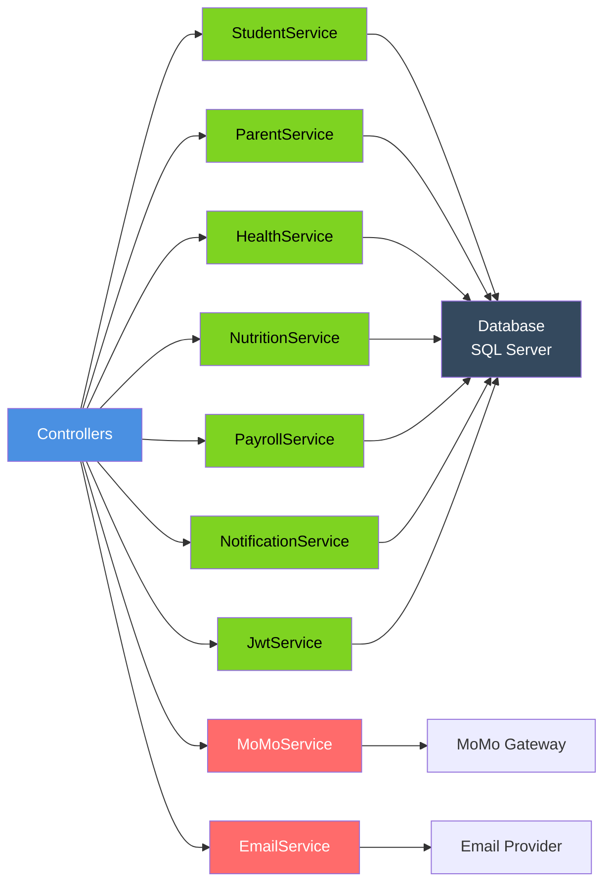

# Database Diagrams - Kindergarten Management System

## 1. DFD - Context Level (Level -1)

---

## 2. DFD - Level 0 (Main Processes)

---

## 3. DFD - Level 1 (Detailed Processes)

```mermaid
graph TD
    subgraph P1["1. Account & Auth Management"]
        P1A["1.1 Register/Login"]
        P1B["1.2 Manage Roles"]
        P1C["1.3 Password Reset"]
        P1D["1.4 Token Management"]
    end
    
    subgraph P2["2. Educational Management"]
        P2A["2.1 Manage Classes"]
        P2B["2.2 Manage Subjects & Curriculums"]
        P2C["2.3 Create Class Schedules"]
        P2D["2.4 Manage Teaching Plans"]
    end
    
    subgraph P3["3. Student Management"]
        P3A["3.1 Register Students"]
        P3B["3.2 Assign to Classes"]
        P3C["3.3 Update Student Info"]
    end
    
    subgraph P4["4. Attendance & Health Tracking"]
        P4A["4.1 Track Student Attendance"]
        P4B["4.2 Record Daily Reports"]
        P4C["4.3 Monitor Health Records"]
        P4D["4.4 Track Study Progress"]
    end
    
    subgraph P5["5. Financial Management"]
        P5A["5.1 Manage Fees & Tuition"]
        P5B["5.2 Process Payments"]
        P5C["5.3 Track Payment Status"]
        P5D["5.4 Menu & Override Management"]
    end
    
    subgraph P6["6. HR & Payroll"]
        P6A["6.1 Manage Employees"]
        P6B["6.2 Track Work Attendance"]
        P6C["6.3 Process Payroll"]
        P6D["6.4 Manage Leave Requests"]
        P6E["6.5 Handle Substitutions"]
    end
    
    D[("📊 Central Database")]
    
    P1A & P1B & P1C & P1D --> D
    P2A & P2B & P2C & P2D --> D
    P3A & P3B & P3C --> D
    P4A & P4B & P4C & P4D --> D
    P5A & P5B & P5C & P5D --> D
    P6A & P6B & P6C & P6D & P6E --> D
    
    D --> A["Notifications, Reports,<br/>Analytics"]
    
    style P1 fill:#FF6B6B,color:#fff
    style P2 fill:#4A90E2,color:#fff
    style P3 fill:#7ED321,color:#000
    style P4 fill:#F39C12,color:#fff
    style P5 fill:#9B59B6,color:#fff
    style P6 fill:#E74C3C,color:#fff
    style D fill:#34495E,color:#fff
```

---

## 4. Entity Relationship Diagram (ERD)

```mermaid
erDiagram
    ACCOUNTS ||--o{ REFRESHTOKENS : has
    ACCOUNTS ||--o{ NOTIFICATIONS : receives
    ACCOUNTS ||--o{ EMPLOYEES : has
    ACCOUNTS ||--o{ PARENTS : has
    ROLES ||--o{ ACCOUNTS : assigns
    
    STUDENTS ||--o{ CLASSES : "enrolled in"
    STUDENTS ||--o{ DAILYREPORTS : "receives"
    STUDENTS ||--o{ HEALTHRECORDS : "has"
    STUDENTS ||--o{ TUITIONS : "pays"
    STUDENTS ||--o{ ATTENDANCES : "records"
    STUDENTS ||--o{ STUDYREPORTS : "receives"
    STUDENTS ||--o{ STUDENTFEECONFIGS : "has"
    STUDENTS ||--o{ PARENTSTUDENTS : "relates to"
    STUDENTS ||--o{ STUDENTACTIVITIES : "participates in"
    STUDENTS ||--o{ MENUOVERRIDES : "requests"
    
    CLASSES ||--o{ ASSIGNMENTS : "has"
    CLASSES ||--o{ CLASSSCHEDULES : "contains"
    CLASSES ||--o{ TEACHINGPLANS : "follows"
    CLASSES ||--o{ CLASSACTIVITIES : "organizes"
    
    EMPLOYEES ||--o{ ASSIGNMENTS : "assigned to"
    EMPLOYEES ||--o{ CLASSSCHEDULES : "teaches"
    EMPLOYEES ||--o{ ATTENDANCES : "records"
    EMPLOYEES ||--o{ ACTIVITIES : "organizes"
    EMPLOYEES ||--o{ EMPLOYEELEAVEREQUESTS : "requests"
    EMPLOYEES ||--o{ WORKATTENDANCES : "records"
    EMPLOYEES ||--o{ SALARIES : "earns"
    EMPLOYEES ||--o{ SUBSTITUTIONS : "handles"
    EMPLOYEES ||--o{ STUDYREPORTS : "writes"
    
    PARENTS ||--o{ PARENTSTUDENTS : "has"
    
    SUBJECTS ||--o{ CURRICULUMS : "has"
    SUBJECTS ||--o{ CLASSSCHEDULES : "taught in"
    SUBJECTS ||--o{ TUITIONDETAILS : "charges"
    
    CURRICULUMS ||--o{ TEACHINGPLANS : "used in"
    
    LOCATIONS ||--o{ CLASSSCHEDULES : "located at"
    LOCATIONS ||--o{ ACTIVITIES : "held at"
    
    MENUS ||--o{ MENUOVERRIDES : "overridden by"
    
    ACTIVITIES ||--o{ CLASSACTIVITIES : "participates"
    ACTIVITIES ||--o{ STUDENTACTIVITIES : "participates"
    
    TUITIONS ||--o{ TUITIONDETAILS : "contains"
    
    FEEITEMS ||--o{ STUDENTFEECONFIGS : "configured for"
    FEEITEMS ||--o{ TUITIONDETAILS : "charged in"
    
    PAYROLLPERIODS ||--o{ SALARIES : "covers"
    
    RANKINGS ||--o{ STUDYREPORTS : "uses"
```

---

## Entity Descriptions

### Core Entities

| Entity | Purpose |
|--------|---------|
| **Accounts** | User login credentials and authentication |
| **Roles** | User role definitions (Manager, Employee, Parent) |
| **Students** | Student information and class assignment |
| **Employees** | Staff information with position and salary |
| **Parents** | Parent/Guardian information |
| **Classes** | Class/Group information with age and capacity |

### Educational Entities

| Entity | Purpose |
|--------|---------|
| **Subjects** | Subject/Course definitions |
| **Curriculums** | Curriculum content by subject and age group |
| **ClassSchedules** | Weekly class timetables |
| **Assignments** | Teacher assignment to classes |
| **TeachingPlans** | Class-Curriculum mappings with timeline |

### Tracking Entities

| Entity | Purpose |
|--------|---------|
| **Attendances** | Student attendance records |
| **WorkAttendances** | Employee work attendance |
| **DailyReports** | Daily student progress notes |
| **HealthRecords** | Student health metrics |
| **StudyReports** | Student learning assessments |

### Financial Entities

| Entity | Purpose |
|--------|---------|
| **Tuitions** | Student payment invoices |
| **TuitionDetails** | Payment line items |
| **FeeItems** | Fee/charge definitions |
| **StudentFeeConfigs** | Custom fee configurations |
| **Salaries** | Employee salary records |

### Operational Entities

| Entity | Purpose |
|--------|---------|
| **Menus** | Daily meal plans |
| **MenuOverrides** | Special meal requests |
| **Activities** | School events and activities |
| **Locations** | Physical locations/classrooms |
| **Holidays** | School holiday dates |

### HR Entities

| Entity | Purpose |
|--------|---------|
| **EmployeeLeaveRequests** | Leave request management |
| **Substitutions** | Teacher substitution tracking |
| **PayrollPeriods** | Payroll period definitions |

---

## Data Flow Summary

### Student Flow
Students → Classes → Attendance → Daily Reports → Study Reports → Parent Notifications

### Financial Flow  
Students → Fee Config → Tuition → Payment Status → Salary Distribution

### HR Flow
Employees → Assignments → Work Attendance → Leave Requests → Payroll

### Educational Flow
Subjects → Curriculums → Class Schedules → Teaching Plans → Assignments

---

## 5. Functional Decomposition Diagram (Based on Codebase)

```mermaid
graph TD
    A["🎓 Kindergarten<br/>Management System"]
    
    A --> B["🔐 Auth & Account<br/>Management"]
    A --> C["👨‍💼 Manager<br/>Dashboard"]
    A --> D["👨‍🏫 Teacher<br/>Dashboard"]
    A --> E["👨‍👩‍👧 Parent<br/>Dashboard"]
    A --> F["📢 Notification<br/>System"]
    A --> G["💳 Financial<br/>Management"]
    
    B --> B1["Login/Logout"]
    B --> B2["Register Account"]
    B --> B3["JWT Token Management"]
    B --> B4["Password Reset"]
    B --> B5["Role-based Access Control"]
    
    C --> C1["📚 Educational Management"]
    C --> C2["👥 Personnel Management"]
    C --> C3["📋 Class Management"]
    C --> C4["💰 Payroll Management"]
    C --> C5["🗓️ System Settings"]
    
    C1 --> C1A["Manage Subjects"]
    C1 --> C1B["Manage Curriculums"]
    C1 --> C1C["Create Class Schedules"]
    C1 --> C1D["Manage Teaching Plans"]
    C1 --> C1E["Create Activities"]
    
    C2 --> C2A["Add/Edit Teachers"]
    C2 --> C2B["Manage Assignments"]
    C2 --> C2C["Approve Leave Requests"]
    C2 --> C2D["Track Work Attendance"]
    C2 --> C2E["View Employee Info"]
    
    C3 --> C3A["Create Classes"]
    C3 --> C3B["Register Students"]
    C3 --> C3C["Assign Students to Classes"]
    C3 --> C3D["View Class Info"]
    C3 --> C3E["Manage Parents"]
    
    C4 --> C4A["Generate Monthly Payroll"]
    C4 --> C4B["Calculate Salaries"]
    C4C["Set Base Salary"]
    C4 --> C4D["View Salary Records"]
    
    C5 --> C5A["Manage Locations"]
    C5 --> C5B["Manage Holidays"]
    C5 --> C5C["Manage Fee Items"]
    C5 --> C5D["View System Logs"]
    
    D --> D1["📝 Attendance Tracking"]
    D --> D2["📊 Reporting"]
    D --> D3["👤 Personal Management"]
    
    D1 --> D1A["Record Check-in/Check-out"]
    D1 --> D1B["Track Class Attendance"]
    D1 --> D1C["Handle Substitutions"]
    D1 --> D1D["View Work Attendance"]
    
    D2 --> D2A["Write Daily Reports"]
    D2 --> D2B["Record Study Reports"]
    D2 --> D2C["View Student Progress"]
    D2 --> D2D["Monitor Health Records"]
    
    D3 --> D3A["View Profile"]
    D3 --> D3B["Request Leave"]
    D3 --> D3C["View Salary Info"]
    D3 --> D3D["Change Password"]
    
    E --> E1["👶 Child Information"]
    E --> E2["📈 Learning Progress"]
    E --> E3["💵 Tuition Payment"]
    E --> E4["📢 Notifications"]
    
    E1 --> E1A["View Child Profile"]
    E1 --> E1B["View Attendance"]
    E1 --> E1C["View Class Info"]
    
    E2 --> E2A["View Daily Reports"]
    E2 --> E2B["View Study Reports"]
    E2 --> E2C["View Health Records"]
    E2 --> E2D["Track Activities"]
    
    E3 --> E3A["View Tuition Invoice"]
    E3 --> E3B["Pay via MoMo"]
    E3 --> E3C["Payment Status"]
    E3 --> E3D["View Fee Items"]
    
    E4 --> E4A["View All Notifications"]
    E4 --> E4B["Mark Read"]
    
    F --> F1["Send Notifications"]
    F --> F2["Track Read Status"]
    F --> F3["Filter by Role"]
    
    G --> G1["🧾 Tuition Management"]
    G --> G2["💳 Payment Processing"]
    G --> G3["🍽️ Nutrition Management"]
    
    G1 --> G1A["Generate Monthly Tuition"]
    G1 --> G1B["Manage Fee Items"]
    G1 --> G1C["Apply Discounts"]
    G1 --> G1D["View Tuition Details"]
    
    G2 --> G2A["MoMo Payment Gateway"]
    G2 --> G2B["Confirm Payment"]
    G2 --> G2C["Payment Tracking"]
    
    G3 --> G3A["Create Daily Menus"]
    G3 --> G3B["Manage Menu Overrides"]
    G3 --> G3C["Handle Allergies"]
    G3 --> G3D["Track Eating Status"]
    
    style A fill:#2C3E50,color:#fff,stroke:#000,stroke-width:3px
    style B fill:#E74C3C,color:#fff
    style C fill:#3498DB,color:#fff
    style D fill:#9B59B6,color:#fff
    style E fill:#1ABC9C,color:#fff
    style F fill:#F39C12,color:#fff
    style G fill:#27AE60,color:#fff
```

### Feature Breakdown by Role

| **Manager** | **Teacher** | **Parent** |
|-------------|-------------|-----------|
| Dashboard Overview | Check In/Out | View Children |
| Class Management | Attendance Tracking | Tuition Payment |
| Student Registration | Daily Reports | Progress Tracking |
| Schedule Creation | Study Reports | Notifications |
| Teacher Assignment | Leave Requests | Health Records |
| Leave Approval | Profile Mgmt | Activities |
| Salary Management | - | - |
| Payroll Processing | - | - |
| Activity Management | - | - |
| System Settings | - | - |

---

## Core Service Layer

---

## Technology Stack

| Layer | Technology |
|-------|-----------|
| **Framework** | ASP.NET Core 9.0 |
| **Database** | SQL Server |
| **ORM** | Entity Framework Core 9.0 |
| **Authentication** | JWT Bearer Token |
| **Authorization** | Role-based Access Control |
| **Real-time** | SignalR (for notifications) |
| **Email** | MailKit |
| **Security** | BCrypt.NET-Next |
| **API Integration** | MoMo Payment Gateway |
| **UI Framework** | Razor Pages/MVC |

