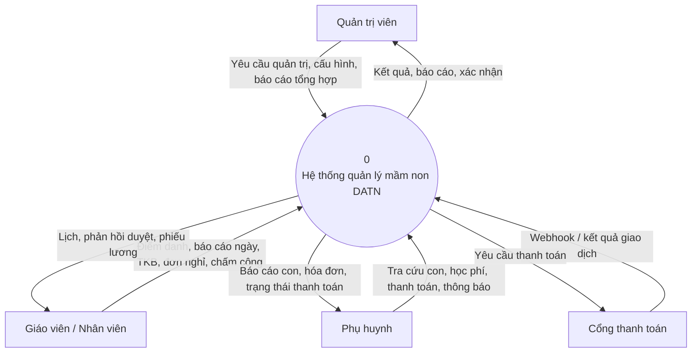
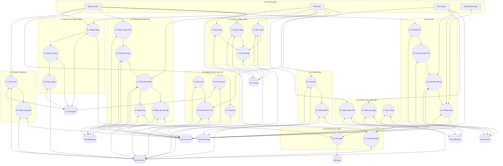

# Sơ đồ DFD & ERD — DATN (4 hình riêng)

> **Nguồn:** `final.sql` · Bỏ `Menus`, `MenuOverrides` · `Subjects` bỏ `Code`, `FeeAmount`  
> **Chỉnh sửa:** Mở từng file `.mmd` trong `docs/diagrams/` hoặc khối Mermaid bên dưới → [mermaid.live](https://mermaid.live) → Export SVG/PNG

---

## Ký hiệu ERD (không dùng chân chim)

| Ký hiệu trên cạnh | Ý nghĩa |
|-------------------|---------|
| **1 : 1** | Một bản ghi bên A tương ứng tối đa một bản ghi bên B (ví dụ `Accounts` ↔ `Employees`) |
| **1 : n** | Một bên A có nhiều bản ghi bên B (ví dụ `Classes` → nhiều `Students`) |
| **n : n** | Hai bảng liên kết qua bảng trung gian: mỗi phía **1 : n** vào bảng đó (ví dụ `Parents` ↔ `ParentStudents` ↔ `Students`) |

---

## Hình 1 — DFD mức ngữ cảnh

File: [`docs/diagrams/01-dfd-ngu-canh.mmd`](diagrams/01-dfd-ngu-canh.mmd)



---

## Hình 2 — DFD mức 0

File: [`docs/diagrams/02-dfd-muc-0.mmd`](diagrams/02-dfd-muc-0.mmd)

```mermaid
flowchart TB
    E1["Quản trị viên"]
    E2["Giáo viên / Nhân viên"]
    E3["Phụ huynh"]
    E4["Cổng thanh toán"]

    P1(("1.0<br/>Xác thực & phân quyền"))
    P2(("2.0<br/>Quản lý nhân sự"))
    P3(("3.0<br/>Quản lý lớp & học sinh"))
    P4(("4.0<br/>Giảng dạy & lịch học"))
    P5(("5.0<br/>Chăm sóc & theo dõi"))
    P6(("6.0<br/>Quản lý học phí"))
    P7(("7.0<br/>Lương & chấm công"))
    P8(("8.0<br/>Hoạt động"))
    P9(("9.0<br/>Thông báo & audit"))

    D1[("D1<br/>Tài khoản & vai trò")]
    D2[("D2<br/>Nhân viên & phụ huynh")]
    D3[("D3<br/>Lớp, học sinh, địa điểm")]
    D4[("D4<br/>Môn, TKB, giáo trình")]
    D5[("D5<br/>Điểm danh, báo cáo, SK")]
    D6[("D6<br/>Học phí")]
    D7[("D7<br/>Lương, chấm công")]
    D8[("D8<br/>Hoạt động")]
    D9[("D9<br/>Nhật ký hệ thống")]

    E1 --> P1 & P2 & P3 & P4 & P6 & P7 & P9
    E2 --> P1 & P2 & P4 & P5 & P7 & P8
    E3 --> P1 & P3 & P5 & P6 & P8 & P9
    E4 <-->|"Thanh toán học phí"| P6

    P1 <-->|"Đăng nhập, token"| D1
    P1 -->|"Thông tin phiên"| D2
    P2 <-->|"Hồ sơ NV, phân công"| D2
    P2 <-->|"Lớp được gán"| D3
    P3 <-->|"Lớp, HS, PH"| D2
    P3 <-->|"Lớp, HS"| D3
    P4 <-->|"TKB, GT, báo cáo học tập"| D4
    P4 <-->|"Lớp"| D3
    P4 <-->|"Giáo viên"| D2
    P5 <-->|"Điểm danh, BC ngày, SK"| D5
    P5 <-->|"Học sinh"| D3
    P5 <-->|"Người ghi nhận"| D2
    P6 <-->|"Hóa đơn, khoản phí"| D6
    P6 <-->|"Học sinh"| D3
    P7 <-->|"Chấm công, lương, nghỉ"| D7
    P7 <-->|"Nhân viên"| D2
    P8 <-->|"Sự kiện, đăng ký"| D8
    P8 <-->|"Lớp, HS"| D3
    P9 <-->|"Thông báo"| D2
    P9 -->|"Ghi log"| D9
    P1 & P6 -->|"Sự kiện bảo mật / TT"| D9
```



---

## Hình 3 — DFD mức 1

File: [`docs/diagrams/03-dfd-muc-1.mmd`](diagrams/03-dfd-muc-1.mmd)



---

## Hình 4 — ERD (1-1, 1-n, n-n)

File: [`docs/diagrams/04-erd.mmd`](diagrams/04-erd.mmd)

**Bảng quan hệ n-n** (mỗi cặp có hai nhánh 1-n vào bảng liên kết):

| Cặp thực thể | Bảng trung gian |
|--------------|-----------------|
| Parents ↔ Students | ParentStudents |
| Employees ↔ Classes | Assignments |
| Classes ↔ Curriculums | TeachingPlans |
| Classes ↔ Activities | ClassActivities |
| Students ↔ Activities | StudentActivities |

```mermaid
flowchart TB
    subgraph G1["I. Tài khoản & người dùng"]
        Roles["Roles"]
        Accounts["Accounts"]
        RefreshTokens["RefreshTokens"]
        Employees["Employees"]
        Parents["Parents"]
        Notifications["Notifications"]
    end

    subgraph G2["II. Lớp & học sinh"]
        Classes["Classes"]
        Students["Students"]
        ParentStudents["ParentStudents"]
        Locations["Locations"]
        Assignments["Assignments"]
    end

    subgraph G3["III. Giảng dạy"]
        Subjects["Subjects"]
        Curriculums["Curriculums"]
        TeachingPlans["TeachingPlans"]
        ClassSchedules["ClassSchedules"]
        Substitutions["Substitutions"]
        Rankings["Rankings"]
        StudyReports["StudyReports"]
        Holidays["Holidays"]
    end

    subgraph G4["IV. Chăm sóc"]
        Attendances["Attendances"]
        DailyReports["DailyReports"]
        HealthRecords["HealthRecords"]
    end

    subgraph G5["V. Học phí"]
        FeeItems["FeeItems"]
        StudentFeeConfigs["StudentFeeConfigs"]
        Tuitions["Tuitions"]
        TuitionDetails["TuitionDetails"]
    end

    subgraph G6["VI. Lương & chấm công"]
        PayrollPeriods["PayrollPeriods"]
        Salaries["Salaries"]
        WorkAttendances["WorkAttendances"]
        EmployeeLeaveRequests["EmployeeLeaveRequests"]
    end

    subgraph G7["VII. Hoạt động"]
        Activities["Activities"]
        ClassActivities["ClassActivities"]
        StudentActivities["StudentActivities"]
    end

    AuditLogs["AuditLogs"]

    Accounts ---|"1 : 1"| Employees
    Accounts ---|"1 : 1"| Parents
    Roles ---|"1 : n"| Accounts
    Accounts ---|"1 : n"| RefreshTokens
    Accounts ---|"1 : n"| Notifications

    Employees ---|"1 : n"| Classes
    Classes ---|"1 : n"| Students
    Parents ---|"1 : n"| ParentStudents
    Students ---|"1 : n"| ParentStudents
    Employees ---|"1 : n"| Assignments
    Classes ---|"1 : n"| Assignments

    Subjects ---|"1 : n"| Curriculums
    Classes ---|"1 : n"| TeachingPlans
    Curriculums ---|"1 : n"| TeachingPlans
    Classes ---|"1 : n"| ClassSchedules
    Subjects ---|"1 : n"| ClassSchedules
    Employees ---|"1 : n"| ClassSchedules
    Locations ---|"1 : n"| ClassSchedules
    ClassSchedules ---|"1 : n"| Substitutions
    Employees ---|"1 : n (GV gốc)"| Substitutions
    Employees ---|"1 : n (GV thay)"| Substitutions
    Students ---|"1 : n"| StudyReports
    Rankings ---|"1 : n"| StudyReports
    Employees ---|"1 : n"| StudyReports

    Students ---|"1 : n"| Attendances
    Employees ---|"1 : n"| Attendances
    Students ---|"1 : n"| DailyReports
    Students ---|"1 : n"| HealthRecords

    Students ---|"1 : n"| StudentFeeConfigs
    FeeItems ---|"1 : n"| StudentFeeConfigs
    Students ---|"1 : n"| Tuitions
    Tuitions ---|"1 : n"| TuitionDetails
    FeeItems ---|"1 : n"| TuitionDetails
    Subjects ---|"1 : n"| TuitionDetails

    Employees ---|"1 : n"| WorkAttendances
    Employees ---|"1 : n"| EmployeeLeaveRequests
    PayrollPeriods ---|"1 : n"| Salaries
    Employees ---|"1 : n"| Salaries

    Locations ---|"1 : n"| Activities
    Employees ---|"1 : n"| Activities
    Classes ---|"1 : n"| ClassActivities
    Activities ---|"1 : n"| ClassActivities
    Students ---|"1 : n"| StudentActivities
    Activities ---|"1 : n"| StudentActivities
```



---

## File ảnh đã xuất (PNG + SVG)

Thư mục: `docs/diagrams/`

| Hình | PNG | SVG | Nguồn chỉnh sửa |
|------|-----|-----|-----------------|
| DFD ngữ cảnh | `01-dfd-ngu-canh.png` | `01-dfd-ngu-canh.svg` | `01-dfd-ngu-canh.mmd` |
| DFD mức 0 | `02-dfd-muc-0.png` | `02-dfd-muc-0.svg` | `02-dfd-muc-0.mmd` |
| DFD mức 1 | `03-dfd-muc-1.png` | `03-dfd-muc-1.svg` | `03-dfd-muc-1.mmd` |
| ERD | `04-erd.png` | `04-erd.svg` | `04-erd.mmd` |

Sửa file `.mmd` rồi chạy lại trong thư mục `docs/diagrams`:

```powershell
npx @mermaid-js/mermaid-cli -i ten-file.mmd -o ten-file.png -b white -w 2400
```
